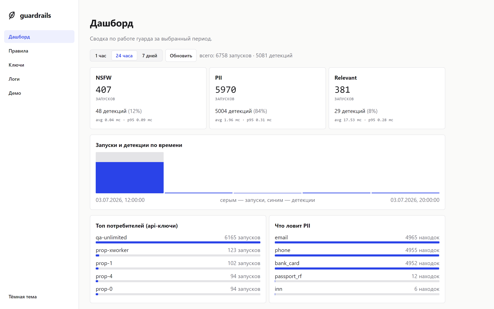

<picture>
  <source media="(prefers-color-scheme: dark)" srcset="docs/assets/feather-light.svg">
  
</picture>

# lite-guardrails


<!-- CI-бейдж: раскомментируйте и подставьте OWNER/REPO после пуша на GitHub:
 -->

**lite-guardrails** — легковесный self-hosted Guardrails для текстовых данных.
Быстрый детерминированный слой на регулярках и словарях (не ML-модель):
разворачивается в своём контуре, конфигурируется через админку, отдаёт метрики и пробы.

📖 **Документация:** <https://maksimov-m.github.io/lite-guardrails/>

Состоит из трёх модулей:

- **PII** — находит персональные данные (email, телефон, банковская карта, ИНН,
  СНИЛС, паспорт РФ, IP, URL) и умеет обратимо их анонимизировать и деанонимизировать.
- **NSFW** — ловит мат и обсценную лексику (RU + EN) по словарю.
- **Релевантность** — отсекает смолток и оффтоп (приветствия, благодарности,
  прощания и т.п.).



## Что детектит

| Модуль | Ловит | Как |
|---|---|---|
| **PII** | email, телефон, банковская карта, ИНН, СНИЛС, паспорт РФ, IP, URL | regex + контрольные суммы (Luhn / ИНН / СНИЛС) и структурная валидация; плюс обратимая **анонимизация** |
| **NSFW** | мат и обсценная лексика RU + EN | словарь + Aho-Corasick, редактируется в админке |
| **Релевантность** | смолток и оффтоп (приветствия, благодарности, прощания и т.п.) | покрытие по фразам-категориям, свои категории через админку |

Пользовательские правила и словари добавляются на лету через админку — рестарт не
нужен. Подробно по каждому модулю — [docs/modules.md](docs/modules.md).

## Из чего состоит

- **API + движок** — FastAPI за gunicorn (по умолчанию 8 воркеров, регулируется
  `WORKERS`): детекция, анонимизация, админ-CRUD, метрики, пробы.
- **Admin UI** — React + nginx: правила, ключи, логи, дашборд.
- **PostgreSQL** — правила, словари, ключи, логи прогонов, версия конфига (миграции
  Alembic).
- **Redis** — обратимые PII-маппинги (TTL) и счётчики rate limit.

Устройство и связи (C4), справочник ручек и конфигурации —
[docs/architecture.md](docs/architecture.md).

## Как развернуть

Нужен Docker + Docker Compose.

```bash
cp .env.example .env          # заполнить ADMIN_TOKEN и пароли БД
docker compose up -d --build  # ui :8080, api :8000 (localhost), postgres :5433
```

Миграции и первичный сид накатываются на старте автоматически. Готовность:

```bash
curl localhost:8000/ready     # {"status":"ready"} когда БД и Redis живы
```

- **Admin UI:** http://localhost:8080 — вход по `ADMIN_TOKEN`.
- **API напрямую:** http://localhost:8000 — обычный FastAPI, Swagger на `/docs`,
  ReDoc на `/redoc`. Порт слушает только `127.0.0.1` (в интернет не торчит);
  открыть по сети — см. `ports` в `docker-compose.yml`.
- **Единая точка входа:** http://localhost:8080 — nginx проксирует API (`/v1`,
  `/admin`) и схему (`/docs`) на тот же origin; для прод-контура публикуйте только
  его (за TLS), а порт `:8000` можно закрыть.
- **Мониторинг (опционально):** конфиги Prometheus и Grafana лежат в папке
  [`monitoring/`](monitoring). Команда `docker compose --profile monitoring up -d`
  автоматически поднимает Prometheus + Grafana с уже настроенным дашбордом (Grafana
  на http://localhost:3000) — провижининг из коробки, руками ничего настраивать не
  нужно. Без профиля они не запускаются. Подробнее — [monitoring/README.md](monitoring/README.md).

### Быстрый старт по API

```bash
# 1. выпустить клиентский ключ (или в UI)
curl -X POST localhost:8000/admin/api-keys \
  -H "X-Admin-Token: $ADMIN_TOKEN" -H "Content-Type: application/json" \
  -d '{"name":"my-app"}'          # -> {"key":"gk_...", ...}

# 2. детекция
curl -X POST localhost:8000/v1/detect/pii \
  -H "X-API-Key: gk_..." -H "Content-Type: application/json" \
  -d '{"text":"мой телефон +79161234567"}'
```

### Python-клиент (SDK)

Вместо сырого HTTP — тонкий клиент [`sdk/python`](sdk/python): подставляет ключ,
делает ретраи, разбирает 401/429 в типизированные ошибки. Есть и **синхронный**
(`GuardrailsClient`), и **асинхронный** (`AsyncGuardrailsClient`) клиент — один и
тот же контракт.

```bash
pip install ./sdk/python
```

```python
from lite_guardrails_client import GuardrailsClient, RateLimitError

with GuardrailsClient("http://localhost:8000", api_key="gk_...") as guard:
    out = guard.detect_pii("мой телефон +79161234567")
    if out["PII_DETECT"]:
        ...
    # deanonymize=True — сохранить mapping в Redis для последующего восстановления
    masked = guard.anonymize("почта ivan@example.com", deanonymize=True)
    original = guard.deanonymize(masked["id"], masked["text"])
```

Подробнее (батч, обработка `RateLimitError.retry_after`, все методы) —
[sdk/python/README.md](sdk/python/README.md).

### JavaScript-клиент (SDK)

Изоморфный клиент [`sdk/js`](sdk/js) на нативном `fetch` (Node 18+ / браузер),
без зависимостей. Тот же контракт и типы ошибок, что в Python.

```bash
npm install ./sdk/js
```

```js
import { GuardrailsClient, RateLimitError } from "lite-guardrails-client";

const guard = new GuardrailsClient("http://localhost:8000", "gk_...");
const out = await guard.detectPii("мой телефон +79161234567");
// deanonymize=true — сохранить mapping в Redis для последующего восстановления
const masked = await guard.anonymize("почта ivan@example.com", true);
const original = await guard.deanonymize(masked.id, masked.text);
```

Подробнее — [sdk/js/README.md](sdk/js/README.md).

Полный список ручек и переменных `.env` — в [docs/architecture.md](docs/architecture.md).

## Разработка

```bash
python -m venv .venv && . .venv/bin/activate   # Windows: .venv\Scripts\activate
pip install -r requirements.txt
pip install pytest ruff

pytest            # тесты (гермётичны: без Postgres/Redis, на in-memory портах)
pytest -m integration   # интеграционные на реальном Postgres (нужен docker)
ruff check .      # линт
```

Фронтенд — в [`frontend/`](frontend) (`npm install && npm run dev`). Правки правил и
словарей применяются на живом сервисе через админку без рестарта.

## Лицензия

[MIT](LICENSE) © 2026 maksim maksimov
