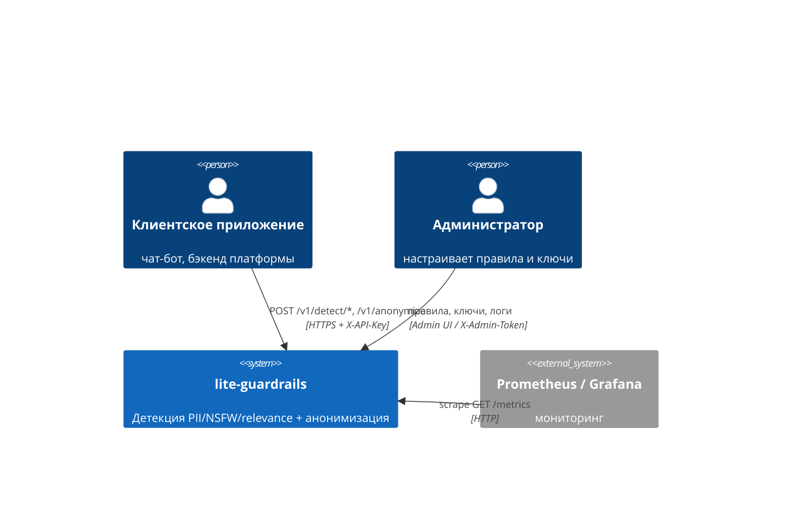
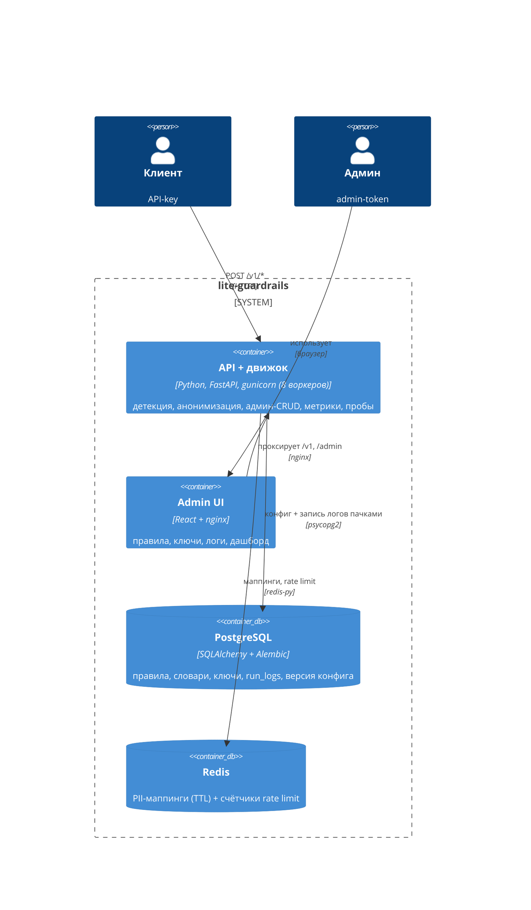
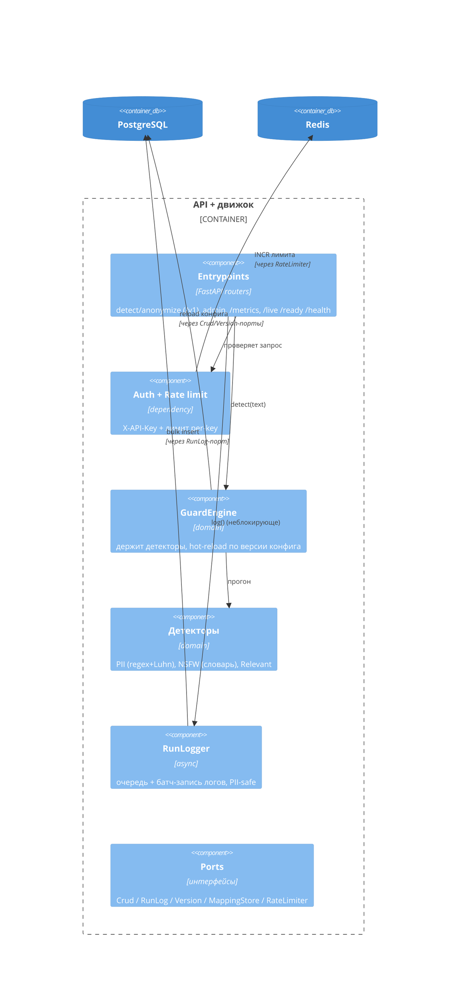

# Архитектура

C4-описание системы (Context → Container → Component) плюс справочник ручек,
конфигурации и мониторинга. Как развернуть — см. [Развёртывание](deployment.md).

## Уровень 1 — контекст

## Уровень 2 — контейнеры

## Уровень 3 — компоненты API (ports & adapters)

## Ключевые решения

- **Ports & adapters** — домен (детекторы) не знает про БД/Redis; смена хранилища =
  новый адаптер, остальной код не трогается.
- **Hot-path не блокирует БД:** детекция — в памяти; запись лога — в очередь +
  фоновый батч в отдельном потоке (`asyncio.to_thread`); блокирующие вызовы (stats,
  метрики, rate limit) уходят в threadpool, не в event loop.
- **Hot-reload конфига:** правка в админке поднимает версию конфига, воркеры
  перечитывают его фоновым поллером — без рестарта.
- **PII не попадает в stdout-логи:** в `run_logs` пишется анонимизированный текст,
  в access-лог — только метаданные (метод/статус/длительность/ключ). Сквозной
  `request-id` для корреляции.
- **Rate limit:** конфиг лимита — в Postgres (колонка у ключа, кэшируется в память),
  счётчики — в Redis (fixed-window, общий на все воркеры); при недоступности Redis
  fail-open.

Справочник ручек, переменных `.env` и мониторинга — в разделе
[Развёртывание](deployment.md).
