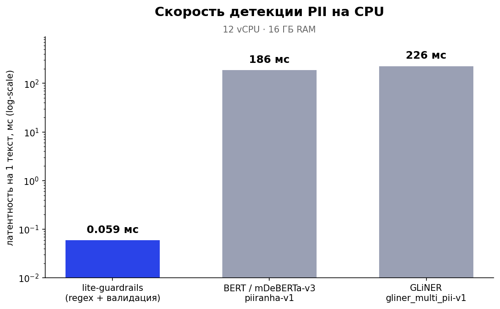
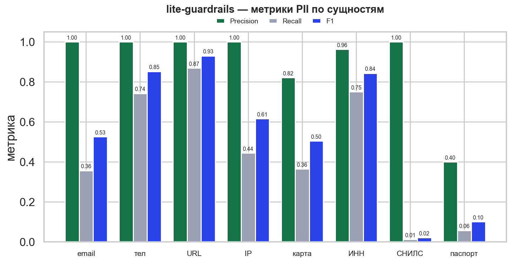
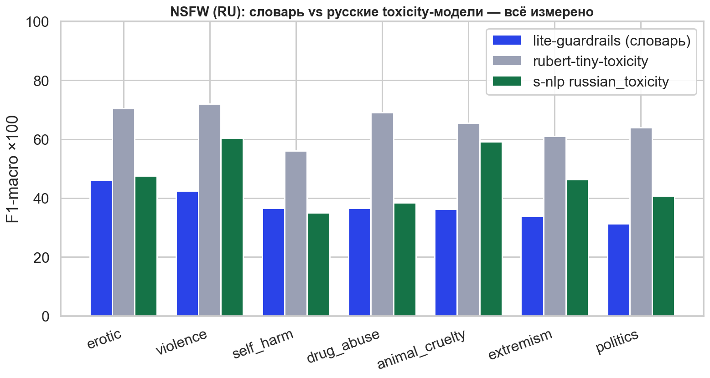

# Сравнение и бенчмарки

Качество и скорость lite-guardrails против ML-моделей, которые решают те же
задачи. Всё измерено на одном стенде — **CPU-ноутбук без GPU** (12 потоков, 16 ГБ
RAM, Python 3.12, по одному тексту, `batch=1`).

Датасеты (RU):
[redmadrobot-rnd/pii_benchmark](https://huggingface.co/datasets/redmadrobot-rnd/pii_benchmark) ·
[redmadrobot-rnd/nsfw_benchmark](https://huggingface.co/datasets/redmadrobot-rnd/nsfw_benchmark).

## Скорость

Главное преимущество — латентность. lite-guardrails работает на регулярках с
контрольными суммами (PII) и словаре с Aho-Corasick (NSFW), поэтому на CPU он на
**3–4 порядка** быстрее любой нейросетевой модели.

| Система | Латентность на 1 текст | Пропускная (1 ядро) |
|---|---|---|
| **lite-guardrails · PII** | **~0.06 мс** | ~11 900 текстов/с |
| **lite-guardrails · NSFW** | **~0.006 мс** | ~156 000 текстов/с |
| BERT — [piiranha-v1](https://huggingface.co/iiiorg/piiranha-v1-detect-personal-information) (mDeBERTa-v3) · PII | ~186 мс | ~5 текстов/с |
| [GLiNER](https://huggingface.co/urchade/gliner_multi_pii-v1) · PII | ~226 мс | ~4 текста/с |
| [rubert-tiny-toxicity](https://huggingface.co/cointegrated/rubert-tiny-toxicity) · NSFW | ~5.3 мс | ~190 текстов/с |
| [s-nlp russian_toxicity](https://huggingface.co/s-nlp/russian_toxicity_classifier) · NSFW | ~82 мс | ~12 текстов/с |

Тяжёлые LLM-гварды (8B–120B) на CPU-ноутбуке без GPU не запускаются вовсе.

## PII — по сущностям

span-level F1 (partial match). lite-guardrails ловит **структурные** идентификаторы
и намеренно не детектит имена/адреса (это зона NER-моделей). Общая точность —
**precision 0.98** (почти нет ложных), recall ниже из-за искажённых/редких форматов.

| Сущность | F1 | Чем берём |
|---|---|---|
| URL | **0.93** | строгий regex |
| телефон | **0.85** | строгий regex |
| ИНН | **0.84** | regex + контрольная сумма (mod-11) |
| IP | 0.61 | regex (диапазоны октетов) |
| email | 0.53 | regex |
| карта | 0.50 | regex + Luhn |
| паспорт РФ | 0.10 | структурная валидация |
| СНИЛС | 0.02 | regex + контрольная сумма (mod-101) |

**ИНН, СНИЛС, паспорт РФ — российские документные ID**, которых нет у зарубежных
NER-моделей. Слабые СНИЛС/паспорт — зона доработки regex (строгие форматы, часть
валидных значений датасета под паттерн не попала).

## NSFW — против русских toxicity-моделей

Честное «RU vs RU» на одном сэмпле и одной метрике. Наш словарь ловит только
обсценную лексику (мат), поэтому по семантическому вреду (насилие, наркотики,
экстремизм) проседает по полноте — но остаётся самым точным и мгновенным.

Бинарно (класс unsafe):

| Модель | F1 | Precision | Recall | Латентность |
|---|---|---|---|---|
| **lite-guardrails** (словарь) | 0.185 | **0.867** | 0.103 | **0.0064 мс** |
| rubert-tiny-toxicity | **0.597** | 0.637 | **0.562** | 5.3 мс |
| s-nlp russian_toxicity | 0.228 | 0.696 | 0.137 | 82 мс |

По категориям (F1-macro ×100):

Лучший из запускаемых на CPU — **rubert-tiny-toxicity** (F1 0.60, все категории
50–72, всего 5 мс/текст). `s-nlp` неожиданно слаб (recall 0.14): он обучен на
*лингвистическую* токсичность, а бенчмарк меряет *смысловой вред*.

## Вывод

lite-guardrails — не замена ML-моделям, а **быстрый предсказуемый первый слой**:
структурные PII с анонимизацией и фильтр профанити за микросекунды, без GPU и
внешних сервисов. Он лидирует по скорости (×3000+ к BERT/GLiNER) и по точности
(precision 0.98), но не претендует на семантику. Практичный паттерн — дешёвый
отсев нашим guard, а спорное (имена, адреса, смысловая токсичность) добирает
недорогая RU-модель поверх (например, `rubert-tiny-toxicity`).
